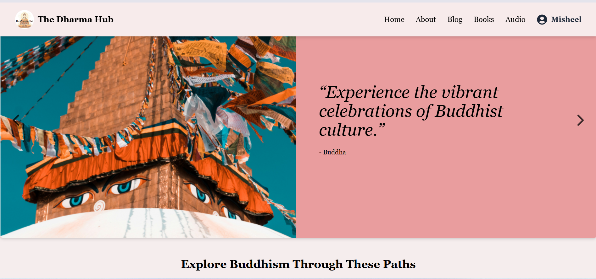

# The Dharma Hub

The Dharma Hub is a web-based platform designed to provide Buddhist practitioners and spiritual seekers with easy access to teachings, cultural resources, audio chanting, blogs, and books in one unified space.

## Screenshots

### 1. Landing Page

### 2. Login Page

### 3. Register Page

### 4. Home Page

### 6. Festival Page

### 7. Learn The Dharma

### 8. Events

### 9. Blogs

### 10. Books

### 11. Wishlist

### 12. Audio

